# llamacpp-serve

A self-hosted, TLS-only [llama.cpp](https://github.com/ggml-org/llama.cpp) serving
stack for a single GPU host (NVIDIA DGX Spark / GB10). It runs two `llama-server`
instances in **router mode** behind an nginx reverse proxy with dynamic,
health-checked upstreams, plus Open WebUI for a browser interface. Every path
into the stack is HTTPS; nothing is published as plain HTTP.

## Highlights

- **2 GPU `llama-server` instances in router mode** on the same host, each with
  full GPU access via NVIDIA CDI (`nvidia.com/gpu=all`).
- **Multi-model serving from one endpoint** — add any `.gguf` to the shared
  model store and, after `docker compose restart llama-1 llama-2`, it shows up
  in `/v1/models` and Open WebUI. Models load on demand (each into its own child
  `llama-server` process) and are LRU-evicted when `--models-max` is reached.
- **Shared model store** — both routers mount the same `var/lib/llama` host
  directory, so each GGUF lives on disk exactly once and either router can serve
  any model.
- **OpenAI-compatible API** — `llama-server` exposes `/v1/chat/completions`,
  `/v1/models`, and a `/health` endpoint, so any OpenAI client (and Open WebUI)
  can talk to it.
- **Redundant routers** — if one router restarts, the health checker drops it
  from the pool and the other keeps serving; its models reload on demand.
- **Dynamic upstream pool** — `healthcheck.sh` probes each instance's socket
  every 5 s and regenerates the nginx upstream, reloading only on change. Failed
  instances are dropped from the pool automatically.
- **Load-balanced routers** — nginx round-robins requests across the healthy
  instances, sharing the load between the two routers.
- **HTTPS-only entry points** on `:11437` (llama.cpp API) and `:11438` (Open WebUI),
  served by a self-signed local CA.
- **Hardened containers** — non-root user (`1000:1000`), `no-new-privileges`,
  and `cap_drop: ALL` on every service.
- **No TCP ports published** except through nginx: containers talk over unix
  sockets bridged by socat.
- **Optional eBPF telemetry** — opt-in OpenTelemetry traces and metrics for the
  whole stack via [OBI](https://opentelemetry.io/docs/zero-code/obi/), with no
  code changes and no restarts, next to llama.cpp's own Prometheus `/metrics`
  for the engine-level view. Off by default; see
  [eBPF telemetry](#ebpf-telemetry-optional).

## Architecture


### Services and ports

| Service       | Container port | Host exposure                                  | Purpose                          |
| ------------- | -------------- | ---------------------------------------------- | -------------------------------- |
| `nginx`       | —              | `:11437` (HTTPS), `:11438` (HTTPS)             | TLS front door for the whole stack |
| `llama-1..2`  | `:8080`        | none (reached via unix sockets)                | GPU routers (on-demand model children) |
| `socat-1..2`  | —              | `var/run/sockets/llama-N.sock` (unix)          | Bridge TCP `:8080` to sockets    |
| `webui`       | `:8080`        | none (reached via unix socket)                 | Open WebUI                       |
| `socat-webui` | —              | `var/run/sockets/webui.sock` (unix)            | Bridge TCP `:8080` to a socket   |

### Request flow (llama.cpp API)


A client calls `https://localhost:11437/v1`. nginx terminates TLS, round-robins
across the healthy sockets, and streams the response back with
`proxy_buffering off` so SSE works end to end. Inside the chosen router,
the `"model"` field in the request selects a model: if it is not loaded yet, the
router spawns a child `llama-server` process for it (inheriting this stack's GPU
access, context, and parallelism settings) and proxies the request to it.

### Request flow (Open WebUI)


The browser loads the UI over `https://localhost:11438`. Open WebUI then calls
back out through the host bridge gateway (`172.31.0.1`) to the same nginx pool
over TLS, using the CA baked into its image. This is why the compose bridge
subnet is pinned: the gateway `172.31.0.1` must be deterministic and present in
the server certificate's SANs.

### Health checks and automatic failover


```sh
healthcheck.sh --watch` runs inside the nginx container. Every 5 s it curls
`/health` over each `llama-N.sock`. If the healthy set changed, it writes
`var/run/nginx/upstream.conf` and reloads nginx — a crashed or restarting
router is removed from the pool with zero downtime. When no router is healthy
the upstream keeps a placeholder `none.sock` so nginx stays valid.
```

## Repository layout

```
├── docker-compose.yml      # The whole stack
├── docker-compose.otel.yml # Optional telemetry overlay (off by default)
├── .env.example            # Optional settings; setup.sh copies it to .env
├── otel/
│   ├── obi/
│   │   └── config.yaml     # What OBI instruments + route names
│   └── collector/
│       ├── local.yaml      # Default pipeline: stays on this host
│       └── forward.yaml    # Relay to an external OTLP/HTTP backend
├── nginx/
│   ├── nginx.conf          # :11437 pool + :11438 webui, TLS-only
│   ├── healthcheck.sh      # Dynamic upstream watcher
│   └── certs/              # Local CA + server cert (gitignored)
├── webui/
│   └── Dockerfile          # Open WebUI + baked-in CA trust
├── var/                    # Runtime data (gitignored)
│   ├── lib/llama           # GGUF model files
│   ├── lib/llama-home      # writable $HOME for the llama containers
│   ├── lib/webui           # SQLite DB + uploads
│   ├── run/sockets         # unix sockets
│   └── run/nginx           # generated upstream.conf
├── docs/diagrams/          # Mermaid sources + rendered SVG/PNG diagrams
└── opencode.json           # Example: point opencode at the local pool
```

## Prerequisites

- Docker + Docker Compose (v2).
- NVIDIA Container Toolkit with CDI enabled (used for `driver: cdi`).
- Run `./setup.sh` to create the required directories and self-signed
  certificates before starting the stack.

## Getting started

```sh
# Run the setup script to create directories and generate self-signed certificates
./setup.sh

# Drop GGUFs into the shared model store, e.g.
#   cp ~/qwen2.5-7b-instruct-q4_k_m.gguf var/lib/llama/
#   cp ~/qwen3-8b-q4_k_m.gguf            var/lib/llama/
# Models are scanned at startup, so start the stack (or restart the routers)
# after adding files. The model ID is the filename without the .gguf extension.

# Start the stack (builds the webui image first time)
docker compose up --build -d

# Use it
curl -k https://localhost:11437/v1/models            # lists every discovered model
curl -k https://localhost:11437/v1/chat/completions -d '{
  "model": "qwen2.5-7b-instruct-q4_k_m",
  "messages": [{"role": "user", "content": "hello"}]
}'
```

Open the UI at <https://localhost:11438> (first-run: create the admin account).

## Configuration knobs

| Setting                               | Where                         | Effect                                   |
| ------------------------------------- | ----------------------------- | ---------------------------------------- |
| `LLAMA_ARG_MODELS_DIR=/models`        | compose `x-llama-base`        | Directory scanned for `.gguf` models (router mode) |
| `LLAMA_ARG_MODELS_MAX=4`              | compose `x-llama-base`        | Max models resident at once per router (LRU eviction) |
| `LLAMA_ARG_CONTEXT_SIZE=16384`        | compose `x-llama-base`        | Context window inherited by every loaded model |
| `LLAMA_ARG_N_GPU_LAYERS=999`          | compose `x-llama-base`        | Offload all layers to the GPU (inherited) |
| `LLAMA_ARG_PARALLEL=2`                | compose `x-llama-base`        | Concurrent slots per loaded model (inherited) |
| `LLAMA_ARG_MODELS_PRESET` (optional)  | compose `x-llama-base`        | Per-model config INI (context, aliases, sharded GGUFs) |
| Number of instances (`1..2`)          | compose `services`            | Scale the router pool (and `INSTANCES` in `healthcheck.sh`) |
| Round-robin / `keepalive 32`      | generated `upstream.conf`     | Load balancing + connection reuse |
| `OPENAI_API_BASE_URL` / `WEBUI_URL`   | compose `webui`               | WebUI backend URL + public UI URL        |
| Probe interval (`INTERVAL=5`)         | `nginx/healthcheck.sh`        | Health-check cadence                     |
| `LLAMA_ENDPOINT_METRICS=true`         | `.env` -> compose `x-llama-base` | llama.cpp's Prometheus `/metrics` endpoint |
| Everything under `OBI_*`, `COLLECTOR_*`, `LLAMA_SCRAPE_*` | `.env`   | eBPF telemetry + engine-metric scrape, see below |

With two routers, up to `2 x LLAMA_ARG_MODELS_MAX` models can be resident at
once across the pool (each router LRU-evicts independently). The total is
bounded by GPU memory.

## eBPF telemetry (optional)

[OpenTelemetry eBPF Instrumentation](https://opentelemetry.io/docs/zero-code/obi/)
(OBI) attaches kernel probes to the processes already running in this stack and
emits OTLP traces and metrics from them. Nothing in the base stack is modified,
rebuilt, or restarted to enable it — the routers, nginx and the webui are
unaware they are being observed.

It is **off by default**. All of it lives in `docker-compose.otel.yml`, which is
purely additive: the base stack behaves identically whether or not the overlay
is loaded.



Note the direction of the arrows. OBI never talks to the base stack over the
network — it observes through the kernel and only *emits* over the network. The
one exception is the dashed edge: the optional Prometheus scrape of llama.cpp's
own `/metrics`, which is a pull and therefore does need network access.

### Enabling it

```sh
cp .env.example .env      # setup.sh already does this
```

Uncomment this one line in `.env`:

```sh
COMPOSE_FILE=docker-compose.yml:docker-compose.otel.yml
```

Then bring the stack up as usual — `obi` and `collector` join it:

```sh
docker compose up -d
```

To try it without touching `.env`:

```sh
docker compose -f docker-compose.yml -f docker-compose.otel.yml up -d
```

### Disabling it

Remove the two containers **before** unloading the overlay, otherwise Compose
forgets they exist and leaves them running:

```sh
docker compose down
```

Then re-comment `COMPOSE_FILE` in `.env` and `docker compose up -d`.

### What gets instrumented

Selectors live in `otel/obi/config.yaml`. OBI runs with `pid: host`, so it can
see every process on the machine; the selectors are what keep it scoped to this
stack. Each one requires a **listening port** *and* `containers_only: true`, so
host daemons and unrelated containers are never touched.

Port alone is ambiguous here — the routers and the webui both listen on 8080 —
so those two entries add an `exe_path` glob. Every selector inside one entry
must match for a process to be instrumented.

| Service         | Matched on                       | Reported as                                      |
| --------------- | -------------------------------- | ------------------------------------------------ |
| `llama-1/2`     | port 8080 + `*/llama-server`     | `llama` — routers split by `service.instance.id`  |
| `nginx`         | ports 11437, 11438               | `nginx`                                          |
| `webui`         | port 8080 + `*/python*`          | `open-webui`                                     |
| model children  | —                                | not matched: they take an ephemeral port, so the router -> child hop is not counted twice |
| `socat-*`       | —                                | excluded (it only shuttles bytes, and would double-count) |

Both routers listen on 8080 inside their own network namespaces, so a single
selector covers the pool and `service.instance.id` distinguishes them — which is
usually what you want from a load-balanced pool.

Request paths are collapsed into low-cardinality route names. The
OpenAI-compatible, llama.cpp-native and router endpoints are listed explicitly
in `routes.patterns`; everything else (notably Open WebUI's
`/api/v1/chats/<uuid>` paths) falls back to OBI's heuristic matcher so metric
cardinality stays bounded.

### Scraping llama.cpp's engine metrics

eBPF sees requests at the HTTP boundary. It cannot see *inside* the engine, so
KV-cache usage, slot occupancy and prompt-vs-generation throughput come from
llama.cpp's own Prometheus endpoint instead — enabled by
`LLAMA_ENDPOINT_METRICS` (on by default) and pulled by the collector into the
same pipeline as OBI's data.

The endpoint is internal-only: nginx denies `/metrics` on `:11437`, so it is
reachable from the `llama` network and from `docker compose exec`, but not
through the front door. That is deliberate — see
[Security notes](#security-notes).

The scrape is **idle until you point it at something**: `LLAMA_SCRAPE_TARGETS`
defaults to an empty list, which registers a scrape job with no targets — no
requests, no log noise. Turn it on in `.env`:

```sh
LLAMA_SCRAPE_TARGETS=["llama-1:8080","llama-2:8080"]
LLAMA_SCRAPE_MODEL=Qwen3-8B-Q4_K_M
```

`LLAMA_SCRAPE_MODEL` is required, and two details about it are worth knowing:

- **Router mode makes `/metrics` per-model.** The router proxies `/metrics` to a
  model's child process, so the request must carry `?model=<id>` — the GGUF
  filename without the extension, exactly as in `GET /v1/models`. Without it the
  router answers `400 model name is missing from the request`.
- **Scrapes pass `autoload=false`, deliberately.** On the router a plain
  `GET /metrics?model=X` *loads* X if it is not resident, because autoload is on
  by default. A recurring scrape would therefore drag LRU-evicted models back
  into VRAM on a timer. With `autoload=false` an unloaded model answers
  `400 model is not loaded` and the target simply reports `up 0`.

One model per collector, since the query parameter is per scrape job. For
several at once, add a `static_configs` entry per model in
`otel/collector/*.yaml` and let the `__param_model` label override the shared
default:

```yaml
static_configs:
  - targets: [llama-1:8080, llama-2:8080]
    labels: { __param_model: Qwen3-8B-Q4_K_M }
  - targets: [llama-1:8080, llama-2:8080]
    labels: { __param_model: gemma-3-4b-it-Q8_0 }
```

### Where the data goes

OBI exports OTLP to the bundled collector on a dedicated `otel` bridge network.
Nothing is published on the host. The collector also joins the base stack's
`llama` network, which is what lets it reach `llama-1:8080` for the scrape above.
`COLLECTOR_CONFIG_FILE` in `.env` picks the pipeline:

| Config                          | Behaviour                                                      |
| ------------------------------- | -------------------------------------------------------------- |
| `otel/collector/local.yaml` (default) | Stays on the box: span/metric counts in `docker compose logs collector`, plus a Prometheus scrape endpoint at `collector:8889/metrics` on the `otel` network |
| `otel/collector/forward.yaml`   | Relays traces and metrics to the OTLP/HTTP backend in `OTLP_FORWARD_ENDPOINT` |

To skip the collector entirely, point `OBI_OTLP_ENDPOINT` straight at your own
OTLP endpoint. Note that the engine-metric scrape lives *in* the collector, so
bypassing it means giving up that half of the picture.

### Checking it works

```sh
docker compose logs obi | head -20
```

`starting Application Observability mode` means OBI loaded its probes. To watch
actual spans, set `OBI_TRACE_PRINTER=text` in `.env`, `docker compose up -d obi`,
send a request through `https://localhost:11437`, then:

```sh
docker compose logs -f obi
```

Set it back to `disabled` when you're done — it prints every span.

llama.cpp's own metrics, straight from a router (needs a loaded model):

```sh
docker compose exec llama-1 curl -s 'http://localhost:8080/metrics?model=Qwen3-8B-Q4_K_M&autoload=false'
```

Scrape the collector's Prometheus endpoint. It is not published on the host, and
the collector image has no shell, so do it from a throwaway container on the
`otel` network — `alpine/socat` is already part of the stack, so nothing new is
pulled:

```sh
docker run --rm --network llamacpp-serve_otel --entrypoint wget alpine/socat -qO- http://collector:8889/metrics
```

Everything OBI produces is there, and once `LLAMA_SCRAPE_TARGETS` is set, so are
the `llamacpp:*` families and an `up` series per target.

### Cost

`OBI_METRICS_INSTRUMENTATIONS` and `OBI_TRACES_INSTRUMENTATIONS` default to just
the protocols this stack speaks (`http`, `genai`, `gpu`) rather than OBI's `*`,
since every extra entry attaches more probes. Nothing here speaks gRPC, so it is
left out. The collector is capped at 768 MB with an internal `memory_limiter`
that sheds telemetry below that, so observability can never starve the GPU
workload.

## Trusting the CA

- **Host / browsers**: add `nginx/certs/ca.crt` to your system/browser trust
  store, then `https://localhost:11437` and `https://localhost:11438` validate
  without warnings.
- **WebUI container**: done automatically via `webui/Dockerfile`
  (`update-ca-certificates` + `SSL_CERT_FILE`/`REQUESTS_CA_BUNDLE`).
- **opencode**: see `opencode.json`, which points `baseURL` at
  `https://localhost:11437/v1` with the local CA trusted by the system store.
  Set `model` (and the model key under `provider.llamacpp.models`) to one of the
  model IDs from `GET /v1/models` — the GGUF filename without the `.gguf`
  extension.

## Troubleshooting

- **Upstream empty / all routers down** — check `var/run/nginx/upstream.conf`;
  the health checker only lists sockets whose `/health` probe succeeds. Verify
  the sockets exist (`ls var/run/sockets`) and the routers are up
  (`docker compose logs llama-1`). A 502 on `:11437` means the pool is empty.
- **No models listed in `/v1/models`** — the router scans `.gguf` files in
  `var/lib/llama/` (mounted read-only at `/models`) **at startup**. Drop a model
  in and restart the routers (`docker compose restart llama-1 llama-2`); it then
  appears in `/v1/models` and the Open WebUI dropdown and loads on its first
  request.
- **First request to a model is slow** — models load on demand into a child
  process; subsequent requests to the same model are served from memory until
  LRU-evicted (see `LLAMA_ARG_MODELS_MAX`).
- **Multi-file / sharded GGUFs** — `--models-dir` scans for standalone `.gguf`
  files only; for sharded models, define them in a presets INI
  (`LLAMA_ARG_MODELS_PRESET`) pointing at the first shard.
- **WebUI can't reach the pool** — confirm the bridge gateway is `172.31.0.1`
  (it is pinned to subnet `172.31.0.0/24`) and that the server certificate
  includes it in its SANs.
- **TLS verification failures from the webui** — the baked-in CA must match
  `nginx/certs/ca.crt`; rebuild the image after rotating the CA
  (`docker compose build webui`).
- **Permission errors on writes** — the stack runs as `1000:1000`; make sure
  `var/` (and the sockets dir) are owned by that user (re-run `./setup.sh`).
- **`400 Invalid Model` in Open WebUI** — the model ID sent by the UI must match
  one listed in `GET /v1/models` (the GGUF filename without the `.gguf`
  extension). Pick the model from the dropdown instead of typing it.
- **`obi` / `collector` don't start** — `COMPOSE_FILE` in `.env` is still
  commented out, or you ran `docker compose` from another directory (the value
  is resolved relative to the working directory). Confirm with
  `docker compose config --services | grep obi`.
- **OBI produces no spans** — it discovers by listening port, so nothing is
  matched until the target is actually up and serving. Check
  `docker compose logs obi` for a missing-capability list (OBI logs it and keeps
  running rather than failing; set `OBI_ENFORCE_SYS_CAPS=true` to make it exit
  instead), and confirm traffic is really flowing through `:11437`.
- **OBI instruments the routers but not the webui (or vice versa)** — both
  listen on 8080, so the `exe_path` glob is what tells them apart. If the
  upstream images move their executables, update the globs in
  `otel/obi/config.yaml`; `docker compose exec webui ps -o comm=` shows what a
  process actually runs.
- **OBI exits with "you need to define at least one exporter"** — an exporter
  endpoint resolved to empty. Either leave `OBI_OTLP_ENDPOINT` commented out in
  `.env` or give it a real value; an empty assignment overrides the default in
  `otel/obi/config.yaml`.
- **Collector exits with "at least one endpoint must be specified"** — you
  selected `forward.yaml` without setting `OTLP_FORWARD_ENDPOINT`.
- **`403` from `https://localhost:11437/metrics`** — by design; nginx denies
  that one location so engine metrics stay off the front door. Read them from
  inside instead (`docker compose exec llama-1 curl -s
  'http://localhost:8080/metrics?model=<id>&autoload=false'`) or let the
  collector scrape them.
- **No `llamacpp:*` metrics in the collector** — the scrape is opt-in: set
  `LLAMA_SCRAPE_TARGETS` *and* `LLAMA_SCRAPE_MODEL` in `.env`. If the target
  reports `up 0`, that model is not currently loaded on that router (scrapes
  never load one — see [above](#scraping-llamacpps-engine-metrics)) or
  `LLAMA_ENDPOINT_METRICS` is false.
- **`obi` containers survive a disable** — run `docker compose down` *before*
  re-commenting `COMPOSE_FILE`, or Compose no longer knows about them.

## Security notes

- TLS-only everywhere; no HTTP listeners are published.
- Every service in the base stack runs unprivileged with `no-new-privileges`
  and no capabilities.
- **The optional `obi` service is the one exception**: eBPF needs `privileged:
  true` and `pid: host`, which is what OBI's own documentation and examples
  use. That combination gives the container effectively full access to the host
  and visibility into every process on it — including memory of processes
  outside this stack. The discovery selectors in `otel/obi/config.yaml` scope
  *what OBI instruments*, but they do not reduce what it *could* reach. Enable
  the overlay only if you accept that trade-off; the base stack is unaffected
  when you don't. `collector` stays hardened like everything else.
- `LLAMA_ENDPOINT_METRICS` is on by default, but **nginx denies `/metrics` on
  `:11437`** so it never leaves the `llama` network. The listener is not bound
  to loopback, so without that block anything able to reach the host could read
  token counts and throughput. The collector scrapes the routers directly
  instead, which is also the only way to get per-router numbers — round-robin
  would send a scrape through the front door to an arbitrary router. Drop the
  `location = /metrics` block from `nginx/nginx.conf` if you want it exposed.
- Traces carry request metadata (routes, status codes, timings, and with
  `genai` enabled, LLM call attributes). Treat the collector's output as
  sensitive, and review `OTLP_FORWARD_ENDPOINT` before shipping it off-host.
- The certs are self-signed and the CA is private to this host — nothing leaves
  the machine.
- Data mounts (`var/lib/llama`, `var/lib/webui`) are plain host directories and
  contain model weights and user chat data; back them up accordingly.
- `.env` is gitignored: it is the one file that may hold backend tokens
  (`OTLP_FORWARD_AUTHORIZATION`).
