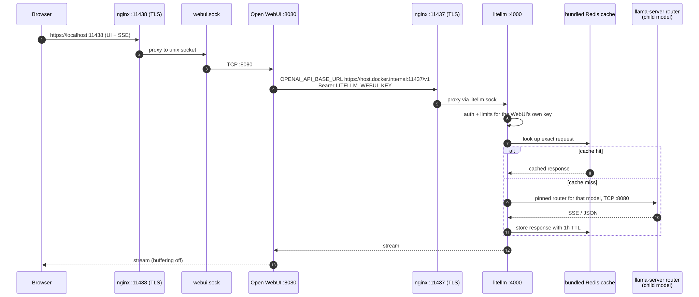
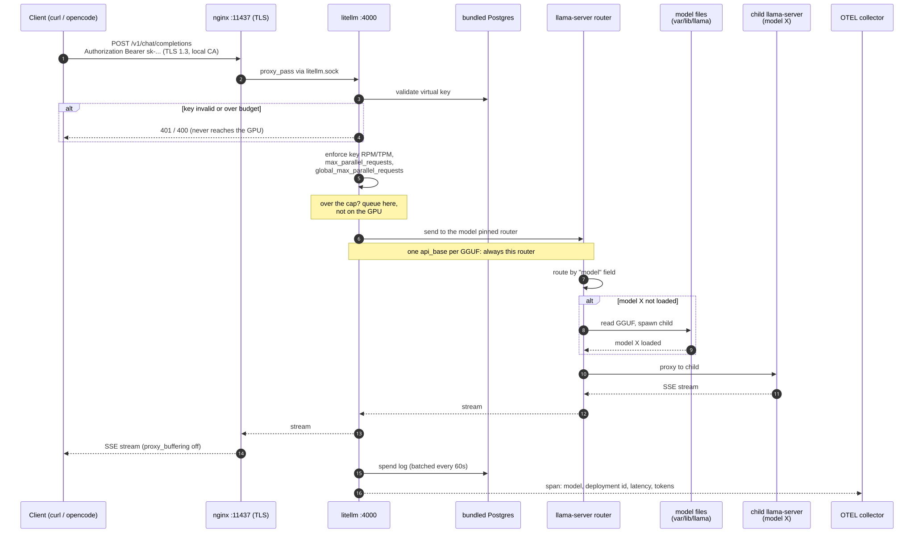

# llamacpp-serve

Self-hosted, TLS-only [llama.cpp](https://github.com/ggml-org/llama.cpp) serving
for a single-GPU host: two `llama-server` routers behind nginx with
health-checked upstreams, Open WebUI for a browser interface, and an optional
[LiteLLM](https://github.com/BerriAI/litellm) gateway for auth, rate limits and
spend logs. Every entry point is HTTPS; nothing is published as plain HTTP.

> [!IMPORTANT]
> **Requires an NVIDIA GPU with Container Toolkit + CDI enabled**
> (`driver: cdi`, `nvidia.com/gpu=all`). Built for a DGX Spark / GB10 — the
> CUDA image and CDI reservation do not run on Docker Desktop or CPU-only
> hosts. Also needs Docker Compose v2.24+ (for `env_file: required` and
> `!override`).


## Quickstart

The base stack — no authentication, smallest setup. Run from the repository root.

```sh
scripts/setup-base-stack.sh                              # runtime dirs + local TLS CA
cp ~/qwen2.5-7b-instruct-q4_k_m.gguf var/lib/llama/      # filename minus .gguf = model ID
docker compose -f docker-compose.yml up --build -d
curl -k https://localhost:11437/v1/models
```

Open WebUI at <https://localhost:11438> and create the first admin account.

Want API keys, per-key rate limits, budgets, spend logs and an admin UI?
Use the [LiteLLM stack](#option-b-full-litellm-stack) instead — it is off by
default and `docker compose up` does not start it.

## Features

- **Two GPU `llama-server` instances in router mode**, each with full GPU access
  via NVIDIA CDI (`nvidia.com/gpu=all`), a 32768 context, and up to two resident
  models. Models load on demand into child processes and LRU-evict.
- **Shared model store** — both routers mount the same `var/lib/llama`, so each
  GGUF lives on disk exactly once.
- **OpenAI-compatible API** — `/v1/chat/completions`, `/v1/models`, `/health`,
  so any OpenAI client (and Open WebUI) can talk to it.
- **Self-healing upstreams** — `healthcheck.sh` probes each router every 5 s and
  regenerates the nginx upstream, reloading only on change. A crashed router
  leaves the pool with zero downtime.
- **Hardened by default** — TLS-only, non-root (`1000:1000`),
  `no-new-privileges`, `cap_drop: ALL`, and no published TCP ports except
  nginx's two; containers talk over unix sockets bridged by socat.
- **Request correlation** — nginx honours or mints an `X-Request-ID`, forwards
  it upstream, echoes it back, and logs it as `rid=`.
- **Optional LiteLLM gateway** — auth, per-key RPM/TPM/budgets, concurrency
  caps, spend logs and OpenTelemetry, with each GGUF pinned to one router.
  No changes to the llama.cpp routers.

## Architecture

| Service       | Container port | Host exposure                                  | Purpose                          |
| ------------- | -------------- | ---------------------------------------------- | -------------------------------- |
| `nginx`       | `:11437`, `:11438` | `:11437` (HTTPS), `:11438` (HTTPS)             | TLS front door for the whole stack |
| `llama-1..2`  | `:8080`        | none (reached via unix sockets)                | GPU routers (on-demand model children) |
| `socat-1..2`  | —              | `var/run/sockets/llama-N.sock` (unix)          | Bridge TCP `:8080` to sockets    |
| `webui`       | `:8080`        | none (reached via unix socket)                 | Open WebUI                       |
| `socat-webui` | —              | `var/run/sockets/webui.sock` (unix)            | Bridge TCP `:8080` to a socket   |

<details>
<summary><b>Request flows and health checking</b> — how a request reaches the GPU</summary>

### Request flow (llama.cpp API)


A client calls `https://localhost:11437/v1`. nginx terminates TLS, round-robins
across the healthy sockets, and streams the response back with
`proxy_buffering off` so SSE works end to end. Inside the chosen router,
the `"model"` field in the request selects a model: if it is not loaded yet, the
router spawns a child `llama-server` process for it (inheriting this stack's GPU
access, context, and parallelism settings) and proxies the request to it.

### Request flow (Open WebUI)


The browser loads the UI over `https://localhost:11438`. Open WebUI then calls
back to `https://host.docker.internal:11437/v1` (the published nginx port on
the host) over TLS, using the CA baked into its image. The server certificate
includes `DNS:host.docker.internal` in its SANs; Linux containers get that name
via `extra_hosts: host.docker.internal:host-gateway`.

With the LiteLLM overlay the same path runs through the gateway, so the WebUI
inherits its limits:



### Health checks and automatic failover


`healthcheck.sh --watch` runs inside the nginx container. Every 5 s it curls
`/health` over each `llama-N.sock`. If the healthy set changed, it writes
`var/run/nginx/upstream.conf` and reloads nginx — a crashed or restarting
router is removed from the pool with zero downtime. When no router is healthy
the upstream keeps a placeholder `none.sock` so nginx stays valid.

This watcher belongs to the default stack only. With the LiteLLM overlay nginx
has no `llama_pool` at all: LiteLLM does the routing and the watcher is not run.

</details>

<details>
<summary><b>Repository layout</b></summary>

```
├── docker-compose.yml           # Default stack (llama.cpp + webui + nginx)
├── docker-compose.litellm.yml   # Overlay: LiteLLM on :11437 + bundled Postgres
├── .env.example                 # Template for .env (LiteLLM secrets, gitignored)
├── litellm/
│   └── config.yaml              # Gateway settings (used only with LiteLLM)
├── scripts/
│   ├── setup-base-stack.sh      # Direct llama.cpp pool setup
│   ├── setup-litellm-stack.sh   # Base setup + LiteLLM/Postgres/secrets
│   ├── apply-model-routing.sh   # Interactive model-to-router placement
│   └── generate-litellm-model-config.sh # Internal model_list generator
├── nginx/
│   ├── nginx.conf               # :11437 pool + :11438 webui, TLS-only
│   ├── nginx.litellm.conf       # :11437 LiteLLM + :11438 webui
│   ├── healthcheck.sh           # Dynamic upstream watcher
│   └── certs/                   # Local CA + server cert (gitignored)
├── webui/
│   └── Dockerfile               # Open WebUI + baked-in CA trust
├── var/                         # Runtime data (gitignored)
│   ├── lib/llama                # GGUF model files
│   ├── lib/llama-home           # writable $HOME for the llama containers
│   ├── lib/webui                # SQLite DB + uploads
│   ├── run/sockets              # unix sockets
│   ├── run/nginx                # generated upstream.conf
│   └── run/litellm              # generated models.generated.yaml
├── docs/diagrams/               # Mermaid sources + rendered SVG/PNG diagrams
└── opencode.json.example        # LiteLLM-authenticated OpenCode example
```

</details>

## First-time setup

Run all commands from the repository root. Choose **one** stack:

| Stack | Choose it when | API on `:11437` |
| ----- | -------------- | ---------------- |
| Base llama.cpp | You want the smallest setup and do not need API authentication | Direct nginx pool, no auth |
| Full LiteLLM | You want authentication, limits, spend logs, model placement and the Admin UI | LiteLLM gateway, key required |

The LiteLLM setup already invokes the base setup. Do not run both setup scripts.

### Option A: base llama.cpp stack

<details>
<summary>Four commands — same as the quickstart above, with verification</summary>

1. Create the runtime directories and local TLS certificates:

```sh
scripts/setup-base-stack.sh
```

2. Copy one or more standalone GGUFs into the model store. The filename without
   `.gguf` becomes the model ID:

```sh
cp ~/qwen2.5-7b-instruct-q4_k_m.gguf var/lib/llama/
```

3. Build and start the base stack:

```sh
docker compose -f docker-compose.yml up --build -d
```

4. Verify it:

```sh
curl -k https://localhost:11437/v1/models
curl -k -H 'Content-Type: application/json' \
  https://localhost:11437/v1/chat/completions -d '{
  "model": "qwen2.5-7b-instruct-q4_k_m",
  "messages": [{"role": "user", "content": "hello"}]
}'
```

Open WebUI at <https://localhost:11438> and create its first admin account.

</details>

### Option B: full LiteLLM stack

<details>
<summary>Six steps — setup, enable the overlay, place models, start, verify</summary>

1. Create the base runtime, TLS certificates, `.env`, generated secrets and the
   LiteLLM runtime. **Run this before copying any GGUF into the model store**
   (see step 3):

```sh
scripts/setup-litellm-stack.sh --auto --yes
```

This does not assign any models — the store is still empty. It writes a
placeholder `var/run/litellm/models.generated.yaml` containing `model_list: []`,
which exists only so the LiteLLM bind mount resolves:
`docker-compose.litellm.yml` mounts that path with `create_host_path: false`,
so the file must already exist as a file or `docker compose up` fails. Step 4
is what actually populates it. The `--auto --yes` flags only keep this nested
placement call non-interactive; with zero models there is nothing to place.

2. Enable the overlay for subsequent `docker compose` and model-routing
   commands. In `.env`, uncomment or add exactly this line:

```dotenv
COMPOSE_FILE=docker-compose.yml:docker-compose.litellm.yml
```

3. Copy up to four standalone GGUFs into the model store:

```sh
cp ~/big-model.gguf   var/lib/llama/
cp ~/small-model.gguf var/lib/llama/
```

4. Assign each model to instance 1 or 2. Each instance can own at most two
   models. `--no-restart` is required here because the stack is not running yet:

```sh
scripts/apply-model-routing.sh --no-restart
```

Review the proposed placement and confirm it. The command writes the persistent
placement (`var/lib/llama/model-routing.tsv`) and the generated LiteLLM model
list.

> [!NOTE]
> **If you copied GGUFs in before step 1**, that step's inherited `--auto`
> already placed them by round-robin and, as auto mode always does, left no
> `model-routing.tsv` behind. This step then starts from no defaults — the
> `[1/2, current N]` prompts will not appear. Assign every model explicitly
> here, or re-run with `--auto --yes` to accept round-robin placement.

5. Build and start the full stack:

```sh
docker compose up --build -d
```

6. Verify the authenticated API:

```sh
KEY=$(sed -n 's/^LITELLM_MASTER_KEY=//p' .env)
curl -k -H "Authorization: Bearer $KEY" \
  https://localhost:11437/v1/models
```

Open the LiteLLM Admin UI at <https://localhost:11437/ui> using
`UI_USERNAME` / `UI_PASSWORD` from `.env`. Open WebUI at
<https://localhost:11438>. Create a dedicated LiteLLM virtual key after the
first login; the generated master key should be used only for administration.

</details>

### After the first start

- **Base stack:** after adding or removing a GGUF, restart discovery with
  `docker compose -f docker-compose.yml restart llama-1 llama-2`.
- **LiteLLM stack:** after adding or removing a GGUF, run
  `scripts/apply-model-routing.sh`. It updates placement and restarts the
  routers and LiteLLM in place.
- Inspect status with `docker compose ps` and logs with
  `docker compose logs -f`.
- Stop and remove containers with `docker compose down`. Runtime data, models
  and Postgres are preserved unless you explicitly remove their volumes/files.

## Configuration

<details>
<summary><b>Configuration knobs</b> — llama.cpp, nginx, WebUI, compose</summary>

| Setting                               | Where                         | Effect                                   |
| ------------------------------------- | ----------------------------- | ---------------------------------------- |
| `LLAMA_ARG_MODELS_DIR=/models`        | compose `x-llama-base`        | Directory scanned for `.gguf` models (router mode) |
| `LLAMA_MODELS_MAX=2`                  | `.env`                        | Max models resident per router — caps how many stay *loaded*, not how many are discovered; the base stack serves every standalone `.gguf` and LRU-evicts past this |
| `LLAMA_CTX_SIZE=32768`                | `.env`                        | Context window inherited by every loaded model |
| `LLAMA_N_GPU_LAYERS=999`              | `.env`                        | Offload all layers to the GPU (inherited); `0` for a CPU-only box |
| `LLAMA_N_PARALLEL=2`                  | `.env`                        | Concurrent slots per loaded model (inherited) |
| `LLAMA_FLASH_ATTN=on`                 | `.env`                        | Flash attention                          |
| `CERT_HOSTNAME`                       | `.env`                        | Extra hostname in the TLS certificate — required for any client that is not on this box |
| `CERT_EXTRA_SANS`                     | `.env`                        | Further SAN entries, comma-separated, each `DNS:`- or `IP:`-prefixed |
| `LLAMA_ARG_MODELS_PRESET` (optional)  | compose `x-llama-base`        | Per-model config INI (context, aliases, sharded GGUFs) |
| Number of instances (`llama-1`, `llama-2`) | compose `services`     | Two servers, up to two resident GGUFs each |
| Round-robin / `keepalive 32`      | generated `upstream.conf`     | Load balancing + connection reuse |
| `OPENAI_API_BASE_URL` / `WEBUI_URL`   | compose `webui`               | WebUI backend URL + public UI URL        |
| Probe interval (`INTERVAL=5`)         | `nginx/healthcheck.sh`        | Health-check cadence                     |
| `COMPOSE_FILE`                        | `.env`                        | `docker-compose.litellm.yml` appended = LiteLLM on |

The `LLAMA_*` keys are mapped onto llama-server's own `LLAMA_ARG_*` variables
in `docker-compose.yml`. Those upstream names are exact: it reads
`LLAMA_ARG_CTX_SIZE` and `LLAMA_ARG_N_PARALLEL`, and a near-miss such as
`LLAMA_ARG_CONTEXT_SIZE` is ignored **without any warning**, silently leaving
you on llama.cpp's 4096 default. Check any new setting against
`docker compose exec llama-1 llama-server --help` before adding it.

With `LLAMA_MODELS_MAX=2`, the two routers can hold up to four model
processes in memory. With LiteLLM, `scripts/apply-model-routing.sh` pins each
of at most four GGUFs to one router, with a maximum of two assignments per
router. Without LiteLLM, nginx round-robin can still place the same GGUF on
both routers; explicit placement applies only to the LiteLLM path.

</details>

<details>
<summary><b>Reaching the stack from another machine</b> — TLS certificate names</summary>

nginx serves a certificate signed by the local CA in `nginx/certs/ca.crt`. A
client has to clear **two** independent checks:

1. **Trust the CA** — see "Trusting the CA" below.
2. **Connect by a name in the certificate** — `localhost`,
   `host.docker.internal` and `127.0.0.1` are always present. Any other name
   must be declared up front.

Miss the second and the handshake fails even though the CA is trusted, because
hostname verification is separate from chain-of-trust. `curl` says
`unable to get local issuer certificate`; Node clients (OpenCode, Pi) surface
it as a generic *connection error*, which is easy to misread as the box being
down or the API key being wrong.

To reach the box as, say, `dgx.example.com`, set this in `.env`:

```sh
CERT_HOSTNAME=dgx.example.com
# optional extras, comma-separated, each DNS:- or IP:-prefixed
CERT_EXTRA_SANS=IP:100.64.0.1, DNS:dgx.internal
```

then reissue and restart nginx:

```sh
scripts/setup-base-stack.sh     # reissues only if a listed name is missing
docker compose restart nginx
```

The CA and its key are preserved, so the WebUI image does **not** need
rebuilding — `webui/Dockerfile` bakes in `ca.crt`, not the server certificate.
Re-running with an unchanged `.env` is a no-op (`Server certificate is
current.`).

Verify before you go hunting elsewhere:

```sh
openssl s_client -connect dgx.example.com:11437 -servername dgx.example.com </dev/null 2>/dev/null \
  | openssl x509 -noout -subject -ext subjectAltName
curl https://dgx.example.com:11437/v1/models -H "Authorization: Bearer sk-..."
```

Use `curl` **without** `-k`. With `-k` this failure is invisible: the
connection succeeds and you will conclude TLS is fine when it is not.

If your tailnet runs on Headscale rather than Tailscale SaaS, note that
`tailscale cert` cannot help here — Headscale does not broker the ACME
challenge, and `tailscale status --json` reports `"CertDomains": null`. Adding
the name to `CERT_HOSTNAME` is the supported path.

</details>

<details>
<summary><b>Trusting the CA</b> — host, browsers, WebUI, OpenCode</summary>

- **Host / browsers**: add `nginx/certs/ca.crt` to your system/browser trust
  store, then `https://localhost:11437` and `https://localhost:11438` validate
  without warnings.
- **WebUI container**: done automatically via `webui/Dockerfile`
  (`update-ca-certificates` + `SSL_CERT_FILE`/`REQUESTS_CA_BUNDLE`).
- **OpenCode with LiteLLM**: copy `opencode.json.example` to your OpenCode
  config location. It points `baseURL` at `https://localhost:11437/v1`.
  It is an example, not a catalog: the example `model` / `small_model` ID
  (`gemma-4-12B-it-Q4_K_M`) is one GGUF name. Set both (and the key under
  `provider.llamacpp.models`) to an ID from `GET /v1/models` — the filename
  without `.gguf` — or OpenCode will 400 against a store that does not contain
  that file. There is no alias; LiteLLM serves the generated routing catalog.
  The example reads `"apiKey": "{env:LITELLM_API_KEY}"`; exporting a LiteLLM
  key is required:

  ```sh
  export LITELLM_API_KEY=sk-...        # a LiteLLM virtual key
  export NODE_EXTRA_CA_CERTS=$PWD/nginx/certs/ca.crt
  ```

  Use a virtual key from the Admin UI for normal clients. The master key is
  suitable only for initial bootstrap and administration.

</details>

## Optional: LiteLLM gateway

LiteLLM is **not** part of the default stack. Enable it when you want every
GPU-bound request authenticated, rate-limited, concurrency-capped, logged and
traced. The llama.cpp routers do not change; nginx `:11437` is pointed at
LiteLLM instead of the socket pool. Each of at most four GGUFs is pinned to
exactly one router, with up to two assigned models per router.



For a new installation, follow
[Option B in the first-time setup](#option-b-full-litellm-stack). Do not start
the overlay before its setup and model-routing commands have generated
`var/run/litellm/models.generated.yaml`.

| Port     | Serves                                     | Auth                     |
| -------- | ------------------------------------------ | ------------------------ |
| `:11437` | LiteLLM OpenAI API (`/v1/...`) + Admin UI (`/ui`) | Virtual key / master key |
| `:11438` | Open WebUI                                 | Open WebUI accounts      |

llama.cpp is not published. Clients and Open WebUI only reach the GPU through
LiteLLM on `:11437`.

<details>
<summary><b>How the gateway path works</b> — request flow, Postgres, Responses API limits</summary>

Postgres is **bundled** (no host port). LiteLLM keeps virtual keys, teams,
budgets, rate-limit counters and spend logs there, and migrates its own schema
on startup. To use a remote database instead, change `DATABASE_URL` on the
`litellm` service in `docker-compose.litellm.yml`.



A client calls `https://localhost:11437/v1` with a virtual key. nginx terminates
TLS and forwards to LiteLLM over `litellm.sock`. LiteLLM authenticates the key,
applies RPM/TPM/budget and concurrency caps (queueing overflow instead of
hitting the GPU), sends the request to that model's **pinned** router
(one `api_base` per GGUF), streams the response, then writes a spend log and an
OpenTelemetry span.

Stock OpenAI clients can connect unmodified (`/v1/chat/completions`,
`/v1/models`). That is not full Responses compatibility. Each generated
deployment sets `use_chat_completions_api: true` and
`additional_drop_params: ["previous_response_id"]`: LiteLLM bridges
`/v1/responses` to llama.cpp's `/chat/completions`, and
`previous_response_id` is discarded, so Responses-style conversation
continuation is unavailable. Send the full message history on each chat turn
instead of chaining `previous_response_id`.

A pinned router that dies takes its models with it — LiteLLM does not fail
them over onto a neighbour, because placement is explicit and the neighbour
may already have two resident models.

Open WebUI keeps calling `:11437`, so it inherits the limits automatically
via `LITELLM_WEBUI_KEY`. `scripts/setup-litellm-stack.sh` bootstraps that to
the master key; create a dedicated virtual key in the Admin UI afterwards.

</details>

<details id="adding-or-removing-a-model">
<summary><b>Adding or removing a model</b> — the placement CLI and what <code>--auto</code> costs you</summary>

`llama-server` scans `var/lib/llama` only at startup, and LiteLLM reads its
generated `model_list` only at startup, so both need restarting:

```sh
cp ~/new-model.gguf var/lib/llama/   # or rm var/lib/llama/old.gguf
scripts/apply-model-routing.sh
```

The command lists every standalone GGUF with its size and asks which instance
(1 or 2) should own it. Each instance accepts at most two models. It shows the
complete map before writing `var/lib/llama/model-routing.tsv`, regenerating
`var/run/litellm/models.generated.yaml`, and restarting the routers plus
LiteLLM:

```sh
Instance for big-a [1/2]: 1
Instance for small-a [1/2]: 1
Instance for big-b [1/2]: 2
Instance for small-b [1/2]: 2
```

On subsequent runs the current assignment is offered as the default — press
Enter to keep it. This requires a persisted `model-routing.tsv`, so it does not
apply after an `--auto` run (see below). For unattended use, assign every model
explicitly or use filename-sorted round-robin:

```sh
scripts/apply-model-routing.sh \
  --assign big-a=1 --assign small-a=1 \
  --assign big-b=2 --assign small-b=2 --yes

scripts/apply-model-routing.sh --auto --yes
scripts/apply-model-routing.sh --dry-run
```

> [!WARNING]
> **`--auto` does not persist placement.** Interactive and `--assign` runs write
> `var/lib/llama/model-routing.tsv`; `--auto` deletes it and recomputes
> round-robin from the sorted filenames on every run. Two consequences:
>
> - Adding or renaming a GGUF can **move models that were already placed**,
>   since a name that sorts earlier shifts everything after it to the other
>   router. A model's home router is only stable across runs if placement is
>   persisted.
> - `--auto` runs are not resumable: the next interactive run has no defaults
>   to offer and asks for every model again.
>
> The generated config records which mode produced it — the `# Routing:` header
> in `models.generated.yaml` is either a path to the TSV or the literal
> `automatic filename-sorted round-robin`. Prefer `--assign` for anything you
> intend to keep.

If you select the overlay with explicit `-f` flags instead of `COMPOSE_FILE`,
pass those flags to the command. Restarts happen in place; the script never
uses `compose down`, which could reap overlay services as orphans.

GGUF filenames must be valid model IDs: letters, digits, `.`, `_`, `+` and
`-` only, with no leading `-`. Shards are skipped.

</details>

<details>
<summary><b>Governing GPU access</b> — the layered concurrency and spend controls</summary>

The controls stack from broadest to narrowest — a request has to clear all of
them.

| Control                        | Where                                | What it bounds |
| ------------------------------ | ------------------------------------ | -------------- |
| `global_max_parallel_requests` | `litellm/config.yaml`                | In-flight requests across the entire proxy. The hard backstop. |
| `max_parallel_requests`        | generated per (model, router)         | In-flight requests to one model on one router. Set to `LLAMA_N_PARALLEL`. |
| Key / team RPM, TPM, budget    | Admin UI or `/key/generate`          | What one client may consume per minute, and its spend ceiling. |
| `allowed_fails` / `cooldown_time` | `litellm/config.yaml`             | How fast a failing *pinned* router is pulled out of rotation. |
| One `api_base` per GGUF             | generated model config             | Explicit pin onto `llama-1` or `llama-2`. |

Keep `max_parallel_requests` equal to `LLAMA_N_PARALLEL` (the generator's
default) so the queue forms in LiteLLM — where it is observable and subject to
the key's limits — instead of inside `llama-server`. If you change
`LLAMA_N_PARALLEL` in `.env`, regenerate with a matching
`MAX_PARALLEL`:

```sh
MAX_PARALLEL=4 scripts/apply-model-routing.sh --yes
```

Create a rate-limited key:

```sh
KEY=$(grep '^LITELLM_MASTER_KEY=' .env | cut -d= -f2)
curl -k -X POST https://localhost:11437/key/generate \
  -H "Authorization: Bearer $KEY" -H 'Content-Type: application/json' \
  -d '{"key_alias": "batch-job", "rpm_limit": 10, "tpm_limit": 100000, "max_budget": 0}'
```

</details>

<details>
<summary><b>Observability</b> — Admin UI, OpenTelemetry, structured logs</summary>

- **Admin UI** (<https://localhost:11437/ui>) — per-key and per-model request
  logs, token usage, latency and error rates, backed by the spend log in
  Postgres. Writes are batched every 60 s (`proxy_batch_write_at`).
- **OpenTelemetry** — a span per request, exported to `OTEL_ENDPOINT`. The
  generated deployment ids are `<model>@<router>`. **If you do not run a
  collector, comment out the `otel` entry under `litellm_settings.callbacks`
  in `litellm/config.yaml`** — otherwise LiteLLM logs an export failure for
  every request.
- **Structured logs** — `json_logs: true`, so `docker compose logs litellm` is
  machine-parseable.

Prometheus `/metrics` is a [LiteLLM enterprise feature](https://docs.litellm.ai/docs/proxy/prometheus)
and is not wired up here; the OTEL exporter covers the same ground for free.

</details>

<details>
<summary><b>LiteLLM knobs</b></summary>

| Setting                             | Where                   | Effect                                        |
| ----------------------------------- | ----------------------- | --------------------------------------------- |
| `global_max_parallel_requests: 4`   | `litellm/config.yaml`   | Proxy-wide in-flight ceiling                   |
| `routing_strategy: least-busy`      | `litellm/config.yaml`   | Inert here — one `api_base` per model means there is nothing to balance |
| `num_retries: 1`                    | `litellm/config.yaml`   | Retry the pinned router; no cross-server failover   |
| `request_timeout: 600`              | `litellm/config.yaml`   | Per-request timeout (matches nginx)                 |
| `callbacks` (off by default)        | `litellm/config.yaml`   | Uncomment `["otel"]` when a collector is running    |
| `store_model_in_db: true`           | `litellm/config.yaml`   | Persists models in Postgres so the Admin UI can add/edit them |
| `background_health_checks: false`   | `litellm/config.yaml`   | **Leave off** — it would load every GGUF on a timer |
| `MAX_PARALLEL` (default 2)          | model config generator | Per-deployment concurrency; defaults to `LLAMA_N_PARALLEL` |
| `use_chat_completions_api: true`    | generated per model     | Bridges `/v1/responses` to llama.cpp `/chat/completions` |
| `additional_drop_params`            | generated per model     | Drops `previous_response_id` (llama.cpp rejects it) |
| `model-routing.tsv`                 | `var/lib/llama/`        | Persistent model-to-router assignments; not written by `--auto` |
| `LITELLM_MASTER_KEY` / `LITELLM_SALT_KEY` | `.env`            | Admin credential / credential encryption key  |
| `UI_USERNAME` / `UI_PASSWORD`       | `.env`                  | Admin UI login                                |
| `LITELLM_WEBUI_KEY`                 | `.env`                  | Virtual key Open WebUI authenticates with     |
| `OTEL_EXPORTER` / `OTEL_ENDPOINT` / `OTEL_HEADERS` | `.env`   | Where traces are exported                     |

LiteLLM's own `background_health_checks` is deliberately off. It works by
sending a real completion to every entry in `model_list`, which under router
mode would load every GGUF into VRAM on a timer and LRU-thrash the GPU.

</details>

## Troubleshooting

<details>
<summary><b>Base stack</b> — upstreams, model discovery, TLS, permissions, CUDA</summary>

- **Upstream empty / all routers down** — check `var/run/nginx/upstream.conf`;
  the health checker only lists sockets whose `/health` probe succeeds. Verify
  the sockets exist (`ls var/run/sockets`) and the routers are up
  (`docker compose logs llama-1`). A 502 on `:11437` means the pool is empty.
- **No models listed in `/v1/models`** — the router scans `.gguf` files in
  `var/lib/llama/` (mounted read-only at `/models`) **at startup**. Drop a model
  in and run `scripts/apply-model-routing.sh`; it then
  appears in `/v1/models` and the Open WebUI dropdown and loads on its first
  request.
- **First request to a model is slow** — models load on demand into a child
  process; subsequent requests to the same model are served from memory until
  LRU-evicted (see `LLAMA_MODELS_MAX`).
- **Multi-file / sharded GGUFs** — `--models-dir` scans for standalone `.gguf`
  files only; for sharded models, define them in a presets INI
  (`LLAMA_ARG_MODELS_PRESET`) pointing at the first shard.
- **WebUI can't reach the pool** — Open WebUI calls
  `https://host.docker.internal:11437`. Confirm nginx published `:11437`, that
  the server certificate includes `DNS:host.docker.internal`, and (on Linux)
  that `extra_hosts: host.docker.internal:host-gateway` is present on `webui`.
- **TLS verification failures from the webui** — the baked-in CA must match
  `nginx/certs/ca.crt`; rebuild the image after rotating the CA
  (`docker compose build webui`).
- **TLS failures from another machine, or a client reporting a bare
  "connection error"** — the certificate almost certainly does not carry the
  name you are connecting by. Check it:

  ```sh
  openssl s_client -connect HOST:11437 -servername HOST </dev/null 2>/dev/null \
    | openssl x509 -noout -subject -ext subjectAltName
  ```

  A stock cert shows `subject=CN=localhost` and only
  `DNS:localhost, DNS:host.docker.internal, IP Address:127.0.0.1`. Set
  `CERT_HOSTNAME` in `.env`, re-run `scripts/setup-base-stack.sh`, then
  `docker compose restart nginx` (see "Reaching the stack from another
  machine"). Note that trusting the CA alone does **not** fix this, and that
  `curl -k` hides it entirely.
- **Context window smaller than configured** — llama-server reads
  `LLAMA_ARG_CTX_SIZE`, not `LLAMA_ARG_CONTEXT_SIZE`; an unrecognised
  `LLAMA_ARG_*` name is ignored silently and you fall back to the 4096 default.
  Confirm what a loaded model actually got with
  `docker compose logs llama-1 | grep n_ctx_slot`.
- **Permission errors on writes** — the stack runs as `1000:1000`; make sure
  `var/` (and the sockets dir) are owned by that user (re-run the relevant
  `scripts/setup-*-stack.sh` as root on Linux).
- **`400 Invalid Model` in Open WebUI** — the model ID sent by the UI must match
  one listed in `GET /v1/models` (the GGUF filename without the `.gguf`
  extension). Pick the model from the dropdown instead of typing it.
- **`docker compose` tries to start LiteLLM / demands `LITELLM_WEBUI_KEY`** —
  `COMPOSE_FILE` in `.env` includes `docker-compose.litellm.yml`. Drop that
  file from the list and `docker compose up -d --remove-orphans`.
- **Placement exits with "at most four" or "maximum is 2"** — remove extra
  standalone GGUFs or rebalance them across the two routers. Shards named
  `*-NNNNN-of-NNNNN` are skipped.
- **CUDA / CDI errors** — this stack needs NVIDIA Container Toolkit with CDI
  on a DGX Spark. `nvidia.com/gpu=all` must be visible to Docker.

</details>

<details>
<summary><b>LiteLLM</b> — auth, Postgres, generated config, OTEL</summary>

- **`401` / `400 Authentication Error`** — `:11437` requires a LiteLLM key
  when that compose file is in use. Pass `Authorization: Bearer sk-...`.
- **LiteLLM won't start / `prisma` or connection errors** — check
  `docker compose logs postgres litellm`. The bundled Postgres must be healthy
  before LiteLLM migrates.
- **`bind source path does not exist: .../models.generated.yaml`** — run
  `scripts/apply-model-routing.sh` (the mount uses `create_host_path: false`
  so Docker cannot silently create a directory there). On a new install
  `scripts/setup-litellm-stack.sh` creates this file as an empty
  `model_list: []` placeholder; this error means that step was skipped.
- **`llama.cpp does not support 'previous_response_id'`** — the pin map predates
  the Responses bridge. Re-run `scripts/apply-model-routing.sh`. Even after that, `/v1/responses`
  is bridged to `/chat/completions` and `previous_response_id` is dropped, so
  Responses conversation continuation is unavailable; send the full message history.
- **An OTEL export error per request** — no collector at `OTEL_ENDPOINT`.
  Comment out the `otel` callback in `litellm/config.yaml`.
- **Is LiteLLM the problem, or the router?** — `docker compose logs llama-1 llama-2`
  vs `docker compose logs litellm`. A 401/400 on `:11437` is LiteLLM auth;
  a 502 with LiteLLM up usually means the pinned router is down.

</details>

## Security notes

- TLS-only everywhere; no HTTP listeners are published.
- Every default service runs unprivileged with `no-new-privileges` and no
  capabilities.
- The certs are self-signed and the CA is private to this host — nothing leaves
  the machine.
- Data mounts (`var/lib/llama`, `var/lib/webui`) are plain host directories and
  contain model weights and user chat data; back them up accordingly.

<details>
<summary><b>With <code>docker-compose.litellm.yml</code></b> — auth boundary, network segmentation, pinned images</summary>

- **`:11437` is authenticated** — LiteLLM rejects requests without a valid
  virtual key. Keep `LITELLM_MASTER_KEY` for administration only. llama.cpp
  itself is not published.
- **`.env` holds the master key and the UI password.** It is gitignored and
  `scripts/setup-litellm-stack.sh` creates it with mode `600`. Spend logs live
  in the bundled Postgres volume.
- `litellm` runs as the image's default user rather than `1000:1000`: the
  non-root image variant has open issues with its startup Prisma migration.
  LiteLLM writes to no host bind mount, so nothing on the host ends up
  root-owned.
- Prompt and response *metadata* (not content) also leaves the host for your
  OTEL collector if you enable it.
- **The routers are not reachable by anything but LiteLLM.** A flat network
  would make the gateway optional: `llama-server` has no authentication and
  listens on `0.0.0.0:8080`, so any peer — including `webui`, which runs
  model-driven tool calls — could call `http://llama-1:8080/v1/...` directly
  and bypass auth, per-key rate limits, accounting and the concurrency cap.
  The overlay therefore splits the flat `llama` network into four segments:

  | Network    | Members                                          | Egress |
  | ---------- | ------------------------------------------------ | ------ |
  | `frontend` | `webui`, `socat-webui`                           | yes    |
  | `llama`    | `nginx`, `socat-litellm`, `litellm`              | yes    |
  | `backend`  | `llama-1`, `llama-2`, `socat-1/2`, `litellm`     | no (`internal`) |
  | `db`       | `postgres`, `litellm`                            | no (`internal`) |

  `litellm` is the only service spanning segments. The webui reaches the API
  the same way an external client does — TLS via `host.docker.internal:11437`
  — so it needs no route to the routers or the database.
- **Supporting images are pinned by digest** (`litellm`, `nginx`, `postgres`,
  `alpine/socat`) so a registry retag cannot change them on restart. The
  llama.cpp image deliberately stays on the rolling `server-cuda` tag; see the
  comment in `docker-compose.yml` for how to pin it too.

</details>

<details>
<summary><b>Rotating the bundled Postgres password</b></summary>

`LITELLM_DB_PASSWORD` in `.env` feeds both `POSTGRES_PASSWORD` and LiteLLM's
`DATABASE_URL`. Postgres only applies `POSTGRES_PASSWORD` when `initdb` runs on
an **empty** volume, so editing `.env` alone does not rotate anything — it just
makes LiteLLM authenticate with the wrong password. Rotate inside the database
as well:

```sh
NEW=$(openssl rand -hex 24)                 # keep it URL-safe: it goes into a DSN
docker compose exec postgres psql -U litellm -d litellm \
  -c "ALTER USER litellm WITH PASSWORD '$NEW';"
sed -i "s|^LITELLM_DB_PASSWORD=.*|LITELLM_DB_PASSWORD=$NEW|" .env
docker compose up -d --force-recreate litellm
```

To start over instead, `docker compose down` and remove the `postgres-data`
volume — that discards virtual keys, teams, budgets and spend history.

If `.env` is lost while the Postgres volume survives, the LiteLLM setup detects
the volume and falls back to the historical `litellm` password.

</details>
