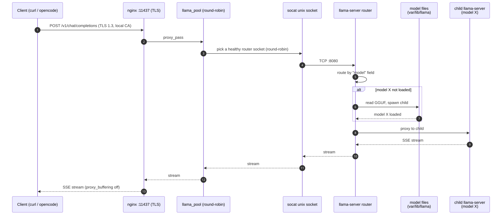
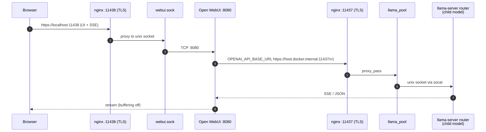

# llamacpp-serve

A self-hosted, TLS-only [llama.cpp](https://github.com/ggml-org/llama.cpp) serving
stack for a single GPU host (NVIDIA DGX Spark / GB10). It runs two `llama-server`
instances in **router mode** behind an nginx reverse proxy with dynamic,
health-checked upstreams and session stickiness, plus Open WebUI for a browser
interface. Every path into the stack is HTTPS; nothing is published as plain
HTTP.

## Highlights

- **2 GPU `llama-server` instances in router mode** on the same host, each with
  full GPU access via NVIDIA CDI (`nvidia.com/gpu=all`).
- **Multi-model serving from one endpoint** — add any `.gguf` to the shared
  model store and, after `docker compose restart llama-1 llama-2`, it shows up
  in `/v1/models` and Open WebUI. Models load on demand (each into its own child
  `llama-server` process) and are LRU-evicted when `--models-max` is reached.
- **Shared model store** — both routers mount the same `var/lib/llama` host
  directory, so each GGUF lives on disk exactly once and either router can serve
  any model.
- **OpenAI-compatible API** — `llama-server` exposes `/v1/chat/completions`,
  `/v1/models`, and a `/health` endpoint, so any OpenAI client (and Open WebUI)
  can talk to it.
- **Redundant routers** — if one router restarts, the health checker drops it
  from the pool and the other keeps serving; its models reload on demand.
- **Dynamic upstream pool** — `healthcheck.sh` probes each instance's socket
  every 5 s and regenerates the nginx upstream, reloading only on change. Failed
  instances are dropped from the pool automatically.
- **Session stickiness** (`ip_hash`) so long conversations stay on one instance.
- **HTTPS-only entry points** on `:11437` (llama.cpp API) and `:11438` (Open WebUI),
  served by a self-signed local CA.
- **Hardened containers** — non-root user (`1000:1000`), `no-new-privileges`,
  and `cap_drop: ALL` on every service.
- **No TCP ports published** except through nginx: containers talk over unix
  sockets bridged by socat.

## Architecture



### Services and ports

| Service       | Container port | Host exposure                                  | Purpose                          |
| ------------- | -------------- | ---------------------------------------------- | -------------------------------- |
| `nginx`       | —              | `:11437` (HTTPS), `:11438` (HTTPS)             | TLS front door for the whole stack |
| `llama-1..2`  | `:8080`        | none (reached via unix sockets)                | GPU routers (on-demand model children) |
| `socat-1..2`  | —              | `var/run/sockets/llama-N.sock` (unix)          | Bridge TCP `:8080` to sockets    |
| `webui`       | `:8080`        | none (reached via unix socket)                 | Open WebUI                       |
| `socat-webui` | —              | `var/run/sockets/webui.sock` (unix)            | Bridge TCP `:8080` to a socket   |

### Request flow (llama.cpp API)



A client calls `https://localhost:11437/v1`. nginx terminates TLS, selects a
healthy socket for the client IP via `ip_hash`, and streams the response back
with `proxy_buffering off` so SSE works end to end. Inside the chosen router,
the `"model"` field in the request selects a model: if it is not loaded yet, the
router spawns a child `llama-server` process for it (inheriting this stack's GPU
access, context, and parallelism settings) and proxies the request to it.

### Request flow (Open WebUI)



The browser loads the UI over `https://localhost:11438`. Open WebUI then calls
back out through the host bridge gateway (`172.31.0.1`) to the same nginx pool
over TLS, using the CA baked into its image. This is why the compose bridge
subnet is pinned: the gateway `172.31.0.1` must be deterministic and present in
the server certificate's SANs.

### Health checks and automatic failover



```sh
healthcheck.sh --watch` runs inside the nginx container. Every 5 s it curls
`/health` over each `llama-N.sock`. If the healthy set changed, it writes
`var/run/nginx/upstream.conf` and reloads nginx — a crashed or restarting
router is removed from the pool with zero downtime. When no router is healthy
the upstream keeps a placeholder `none.sock` so nginx stays valid.
```

## Repository layout

```
├── docker-compose.yml      # The whole stack
├── nginx/
│   ├── nginx.conf          # :11437 pool + :11438 webui, TLS-only
│   ├── healthcheck.sh      # Dynamic upstream watcher
│   └── certs/              # Local CA + server cert (gitignored)
├── webui/
│   └── Dockerfile          # Open WebUI + baked-in CA trust
├── var/                    # Runtime data (gitignored)
│   ├── lib/llama           # GGUF model files
│   ├── lib/llama-home      # writable $HOME for the llama containers
│   ├── lib/webui           # SQLite DB + uploads
│   ├── run/sockets         # unix sockets
│   └── run/nginx           # generated upstream.conf
├── docs/diagrams/          # Mermaid sources + rendered SVG/PNG diagrams
└── opencode.json           # Example: point opencode at the local pool
```

## Prerequisites

- Docker + Docker Compose (v2).
- NVIDIA Container Toolkit with CDI enabled (used for `driver: cdi`).
- Run `./setup.sh` to create the required directories and self-signed
  certificates before starting the stack.

## Getting started

```sh
# Run the setup script to create directories and generate self-signed certificates
./setup.sh

# Drop GGUFs into the shared model store, e.g.
#   cp ~/qwen2.5-7b-instruct-q4_k_m.gguf var/lib/llama/
#   cp ~/qwen3-8b-q4_k_m.gguf            var/lib/llama/
# Models are scanned at startup, so start the stack (or restart the routers)
# after adding files. The model ID is the filename without the .gguf extension.

# Start the stack (builds the webui image first time)
docker compose up --build -d

# Use it
curl -k https://localhost:11437/v1/models            # lists every discovered model
curl -k https://localhost:11437/v1/chat/completions -d '{
  "model": "qwen2.5-7b-instruct-q4_k_m",
  "messages": [{"role": "user", "content": "hello"}]
}'
```

Open the UI at <https://localhost:11438> (first-run: create the admin account).

## Configuration knobs

| Setting                               | Where                         | Effect                                   |
| ------------------------------------- | ----------------------------- | ---------------------------------------- |
| `LLAMA_ARG_MODELS_DIR=/models`        | compose `x-llama-base`        | Directory scanned for `.gguf` models (router mode) |
| `LLAMA_ARG_MODELS_MAX=4`              | compose `x-llama-base`        | Max models resident at once per router (LRU eviction) |
| `LLAMA_ARG_CONTEXT_SIZE=32768`        | compose `x-llama-base`        | Context window inherited by every loaded model |
| `LLAMA_ARG_N_GPU_LAYERS=999`          | compose `x-llama-base`        | Offload all layers to the GPU (inherited) |
| `LLAMA_ARG_PARALLEL=2`                | compose `x-llama-base`        | Concurrent slots per loaded model (inherited) |
| `LLAMA_ARG_MODELS_PRESET` (optional)  | compose `x-llama-base`        | Per-model config INI (context, aliases, sharded GGUFs) |
| Number of instances (`1..2`)          | compose `services`            | Scale the router pool (and `INSTANCES` in `healthcheck.sh`) |
| `ip_hash` / `keepalive 32`            | generated `upstream.conf`     | Stickiness + connection reuse            |
| `OPENAI_API_BASE_URL` / `WEBUI_URL`   | compose `webui`               | WebUI backend URL + public UI URL        |
| Probe interval (`INTERVAL=5`)         | `nginx/healthcheck.sh`        | Health-check cadence                     |

With two routers, up to `2 x LLAMA_ARG_MODELS_MAX` models can be resident at
once across the pool (each router LRU-evicts independently). The total is
bounded by GPU memory.

## Trusting the CA

- **Host / browsers**: add `nginx/certs/ca.crt` to your system/browser trust
  store, then `https://localhost:11437` and `https://localhost:11438` validate
  without warnings.
- **WebUI container**: done automatically via `webui/Dockerfile`
  (`update-ca-certificates` + `SSL_CERT_FILE`/`REQUESTS_CA_BUNDLE`).
- **opencode**: see `opencode.json`, which points `baseURL` at
  `https://localhost:11437/v1` with the local CA trusted by the system store.
  Set `model` (and the model key under `provider.llamacpp.models`) to one of the
  model IDs from `GET /v1/models` — the GGUF filename without the `.gguf`
  extension.

## Troubleshooting

- **Upstream empty / all routers down** — check `var/run/nginx/upstream.conf`;
  the health checker only lists sockets whose `/health` probe succeeds. Verify
  the sockets exist (`ls var/run/sockets`) and the routers are up
  (`docker compose logs llama-1`). A 502 on `:11437` means the pool is empty.
- **No models listed in `/v1/models`** — the router scans `.gguf` files in
  `var/lib/llama/` (mounted read-only at `/models`) **at startup**. Drop a model
  in and restart the routers (`docker compose restart llama-1 llama-2`); it then
  appears in `/v1/models` and the Open WebUI dropdown and loads on its first
  request.
- **First request to a model is slow** — models load on demand into a child
  process; subsequent requests to the same model are served from memory until
  LRU-evicted (see `LLAMA_ARG_MODELS_MAX`).
- **Multi-file / sharded GGUFs** — `--models-dir` scans for standalone `.gguf`
  files only; for sharded models, define them in a presets INI
  (`LLAMA_ARG_MODELS_PRESET`) pointing at the first shard.
- **WebUI can't reach the pool** — confirm the bridge gateway is `172.31.0.1`
  (it is pinned to subnet `172.31.0.0/24`) and that the server certificate
  includes it in its SANs.
- **TLS verification failures from the webui** — the baked-in CA must match
  `nginx/certs/ca.crt`; rebuild the image after rotating the CA
  (`docker compose build webui`).
- **Permission errors on writes** — the stack runs as `1000:1000`; make sure
  `var/` (and the sockets dir) are owned by that user (re-run `./setup.sh`).
- **`400 Invalid Model` in Open WebUI** — the model ID sent by the UI must match
  one listed in `GET /v1/models` (the GGUF filename without the `.gguf`
  extension). Pick the model from the dropdown instead of typing it.

## Security notes

- TLS-only everywhere; no HTTP listeners are published.
- Every service runs unprivileged with `no-new-privileges` and no capabilities.
- The certs are self-signed and the CA is private to this host — nothing leaves
  the machine.
- Data mounts (`var/lib/llama`, `var/lib/webui`) are plain host directories and
  contain model weights and user chat data; back them up accordingly.
